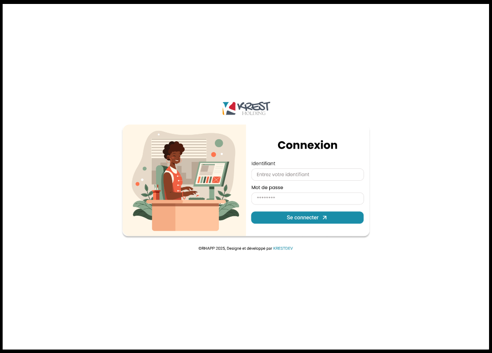
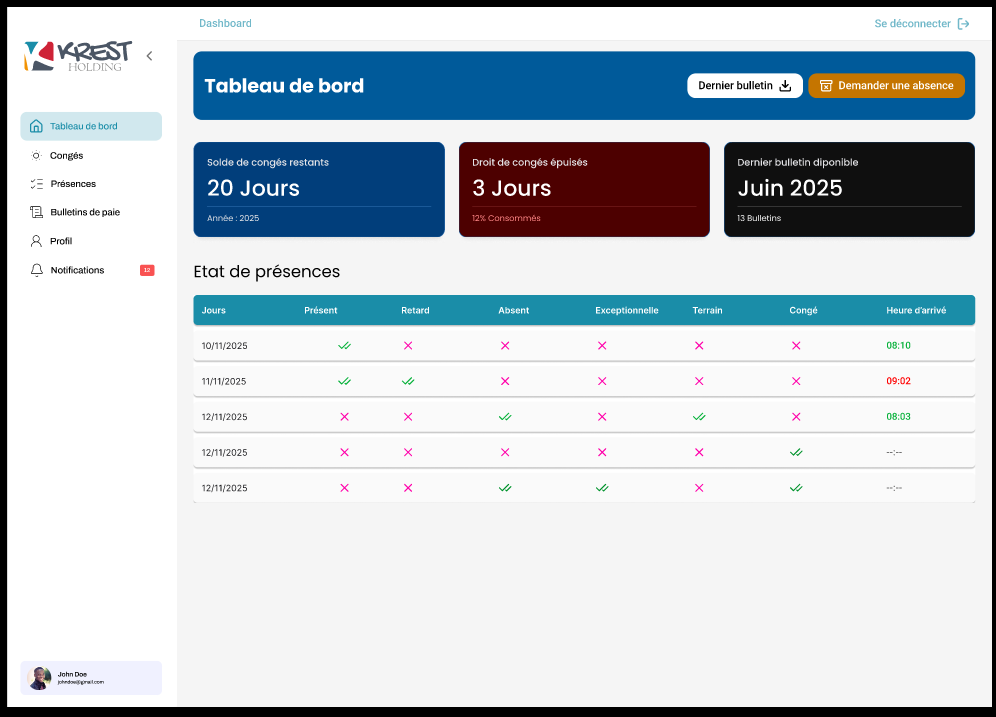
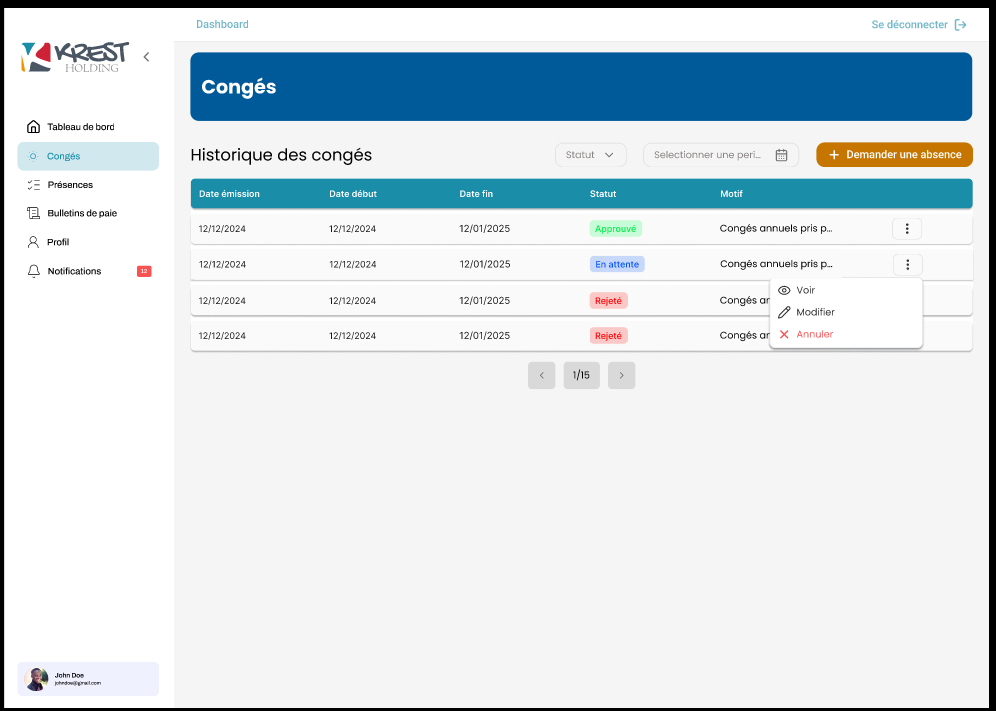
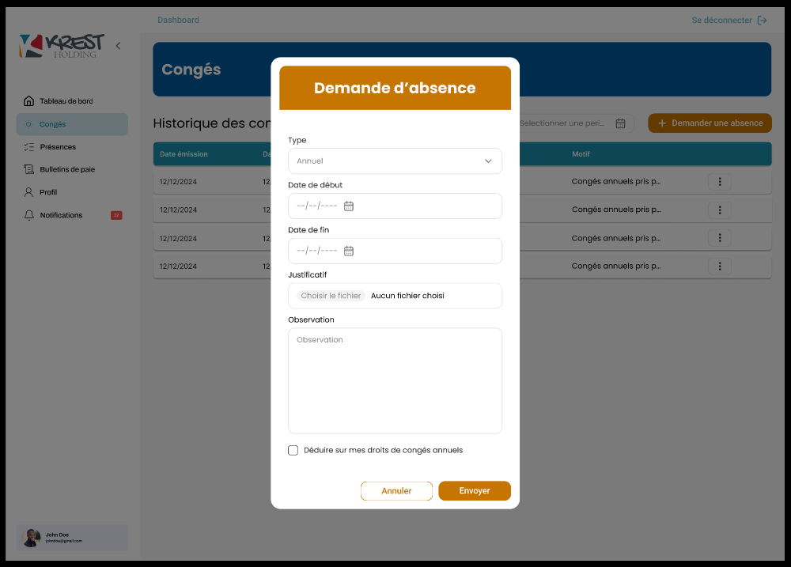
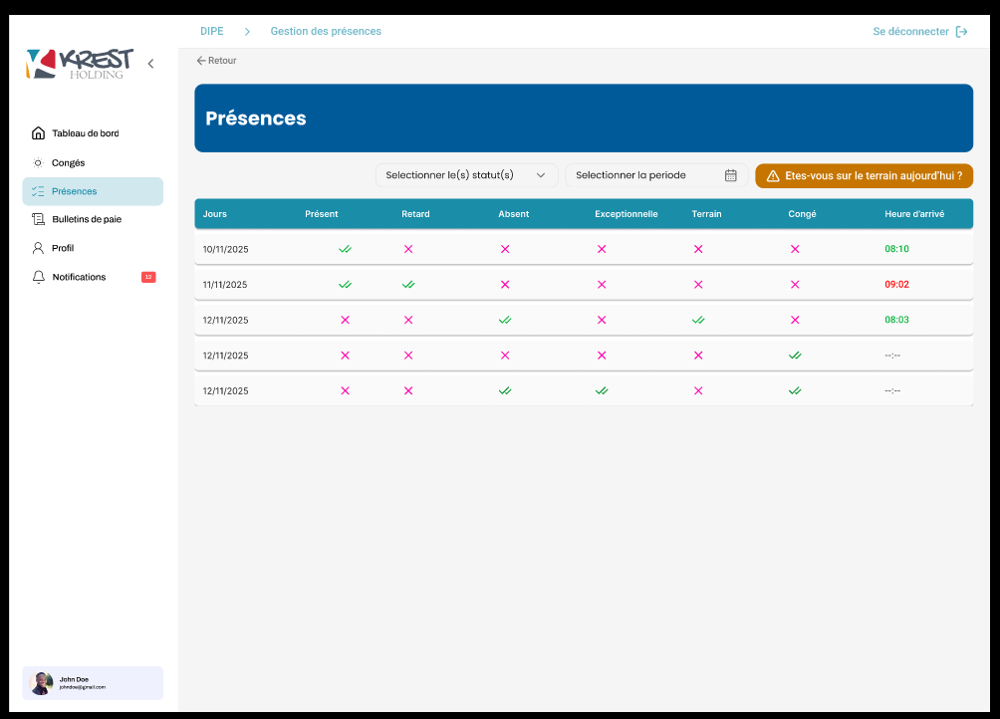
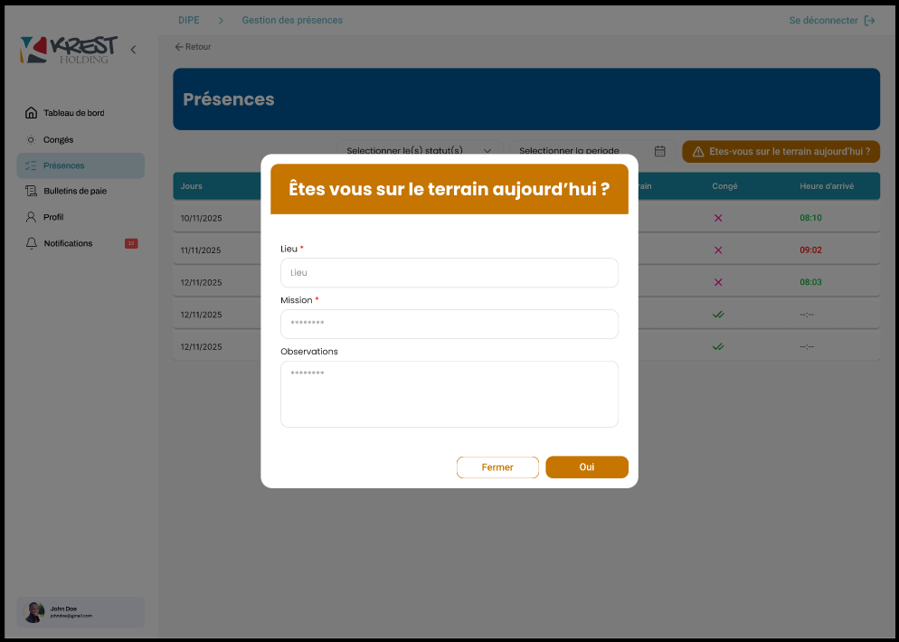
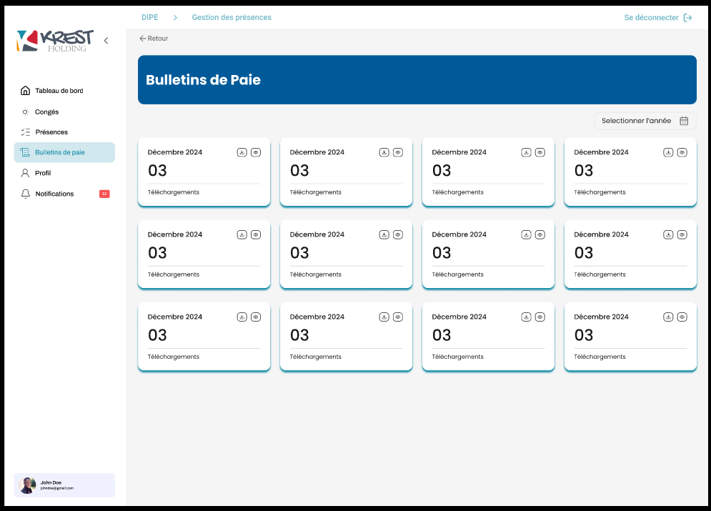
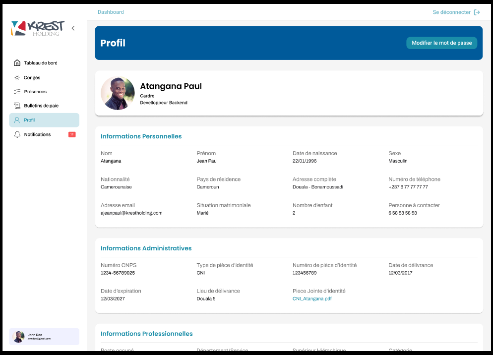

# KREST HR API — Endpoints per Screen

This document maps each Figma screen to the backend endpoints required to power it, along with expected request/response shapes.

---

## 1. Login Screen (`Connexion`)

**Fields shown:** Identifiant, Mot de passe

### `POST /auth/login`



**Request**
```json
{
  "identifiant": "johndoe",
  "password": "********"
}
```

**Response 200**
```json
{
  "accessToken": "eyJhbGciOiJIUzI1NiIs...",
  "refreshToken": "eyJhbGciOiJIUzI1NiIs...",
  "user": {
    "uuid": 1,
    "firstName": "John",
    "lastName": "Doe",
    "email": "johndoe@gmail.com",
    "role": "ADMIN",
    "avatarUrl": ""
  }
}
```

**Response 401**
```json
{
  "statusCode": 401,
  "message": "Invalid credentials"
}
```
## 9. Employee Dashboard (`Tableau de bord`)

**Widgets shown:** Solde de congés restants, Droit de congés épuisés (%), Dernier bulletin disponible
**Buttons:** Dernier bulletin (download), Demander une absence
**Table:** Etat de présences (Jours, Présent, Retard, Absent, Exceptionnelle, Terrain, Congé, Heure d'arrivée — each as check/cross icons)




### `GET /me/dashboard`


**Response 200**
```json
{
  "leaveBalance": {
    "remainingDays": 20,
    "year": 2025
  },
  "leaveConsumed": {
    "usedDays": 3,
    "percentageUsed": 12
  },
  "lastPayslip": {
    "period": "2025-06",
    "label": "Juin 2025",
    "totalBulletins": 13,
    "payslipId": 145
  }
}
```

### `GET /me/attendance?limit=5`

Powers the "Etat de présences" table. Each day returns boolean flags for each status column rather than a single enum, since a day can show multiple states (e.g. both "Présent" and "Retard" can be true the same day).

**Response 200**
```json
{
  "data": [
    {
      "date": "2025-11-10",
      "present": true,
      "late": false,
      "absent": false,
      "exceptional": false,
      "field": false,
      "onLeave": false,
      "arrivalTime": "08:10"
    },
    {
      "date": "2025-11-11",
      "present": true,
      "late": true,
      "absent": false,
      "exceptional": false,
      "field": false,
      "onLeave": false,
      "arrivalTime": "09:02"
    },
    {
      "date": "2025-11-12",
      "present": false,
      "late": false,
      "absent": true,
      "exceptional": false,
      "field": true,
      "onLeave": false,
      "arrivalTime": "08:03"
    },
    {
      "date": "2025-11-12",
      "present": false,
      "late": false,
      "absent": false,
      "exceptional": false,
      "field": false,
      "onLeave": true,
      "arrivalTime": null
    }
  ]
}
```

`arrivalTime` color in the UI:
| Condition | Color |
|---|---|
| On time | green |
| Late | red |
| No check-in (leave/absent) | `--:--` gray |

### `GET /me/payslips/latest` (Dernier bulletin → download button)

**Response 200**
```json
{
  "payslipId": 145,
  "period": "2025-06",
  "downloadUrl": ""
}
```

---

## 10. Employee Leave History (`Congés`)

**Filters:** Statut, Sélectionner une période
**Button:** Demander une absence
**Table columns:** Date émission, Date début, Date fin, Statut, Motif



### `GET /me/leaves`

**Query params**
```
?status=APPROVED
&startDate=2026-01-01
&endDate=2026-12-31
&page=1
&limit=10
```

**Response 200**
```json
{
  "data": [
    {
      "uuid": 12,
      "issueDate": "2024-12-12",
      "startDate": "2024-12-12",
      "endDate": "2025-01-12",
      "status": "APPROVED",
      "reason": "Congés annuels pris pour les fêtes de fin d'année"
    },
    {
      "uuid": 13,
      "issueDate": "2024-12-12",
      "startDate": "2024-12-12",
      "endDate": "2025-01-12",
      "status": "PENDING",
      "reason": "Congés annuels pris pour les fêtes de fin d'année"
    }
  ],
  "meta": { "page": 1, "limit": 10, "totalPages": 15 }
}
```

Row `⋮` menu (only available depending on status, e.g. cancel if still `PENDING`):

### `PATCH /me/leaves/:id/cancel`

**Response 200**
```json
{
  "uuid": 13,
  "status": "CANCELLED"
}
```

---

## 11. Leave Request Modal (`Demande d'absence`)


**Fields:** Type, Date de début, Date de fin, Justificatif (file upload), Observation, checkbox "Déduire sur mes droits de congés annuels"




### `POST /me/leaves`

Sent as `multipart/form-data` because of the file upload (Justificatif).

**Request (multipart fields)**
```
type: "ANNUAL"
startDate: "2026-07-01"
endDate: "2026-07-15"
observation: "Voyage familial"
deductFromAnnualBalance: true
justificatif: <binary file, optional>
```

**Response 201**
```json
{
  "uuid": 30,
  "status": "PENDING",
  "createdAt": "2026-06-17T10:00:00Z",
  "justificatifUrl": ""
}
```

`type` dropdown options come from the same `LeaveType` enum used on the admin side:
```
ANNUAL | SICK | MATERNITY | PATERNITY | UNPAID | OTHER
```

The "Déduire sur mes droits de congés annuels" checkbox only makes sense for non-`ANNUAL` types (e.g. letting an `OTHER` leave optionally count against the annual quota) — confirm this business rule before building, since for `ANNUAL` leave it should probably always be true and disabled.

---

## 12. Employee Attendance Page (`Présences`)

Same shape as the dashboard's "Etat de présences" widget, but as a full page with filters and pagination, plus the field-presence declaration action.

**Filters:** Sélectionner le(s) statut(s) (multi-select), Sélectionner la période
**Button:** "Etes-vous sur le terrain aujourd'hui ?"
**Table:** same columns as dashboard widget




### `GET /me/attendance`

**Query params**
```
?statuses=PRESENT,LATE,FIELD
&startDate=2025-11-01
&endDate=2025-11-30
&page=1
&limit=10
```

**Response 200** — same shape as section 9's `/me/attendance`, with `meta` pagination added.
```json
{
  "data": [
    {
      "date": "2025-11-10",
      "present": true,
      "late": false,
      "absent": false,
      "exceptional": false,
      "field": false,
      "onLeave": false,
      "arrivalTime": "08:10"
    }
  ],
  "meta": { "page": 1, "limit": 10, "totalPages": 15 }
}
```

---

## 13. Field Presence Modal (`Êtes-vous sur le terrain aujourd'hui ?`)

**Fields:** Lieu (required), Mission (required), Observations




### `POST /me/attendance/field-presence`

**Request**
```json
{
  "location": "Bastos, Yaoundé",
  "mission": "Installation serveur client",
  "observations": "RAS",
  "latitude": 3.8480,
  "longitude": 11.5021
}
```

Note: the modal only shows a "Lieu" text field, but per the earlier discussion the backend should still capture device GPS coordinates (`latitude`/`longitude`) alongside the free-text location — reject the request if coordinates are missing, same rule as regular check-in.

**Response 201**
```json
{
  "uuid": 88,
  "date": "2026-06-17",
  "status": "FIELD",
  "createdAt": "2026-06-17T08:00:00Z"
}
```

**Response 422**
```json
{
  "statusCode": 422,
  "errors": {
    "location": ["Lieu requis"],
    "mission": ["Mission requise"],
    "latitude": ["Coordonnées GPS requises"]
  }
}
```

---

## 14. Employee Payslips List (`Bulletins de Paie`)

**Filter:** Sélectionner l'année
**Cards:** one per month, showing month label + bulletin number + download/view icons




### `GET /me/payslips`

**Query params**
```
?year=2024
```

**Response 200**
```json
{
  "data": [
    {
      "payslipId": 132,
      "period": "2024-12",
      "label": "Décembre 2024",
      "bulletinNumber": "03",
      "downloadUrl": "",
      "viewUrl": ""
    }
  ]
}
```

Per-card icons:
| Icon | Action | Endpoint |
|---|---|---|
| ⬇ Download | force download | `GET /me/payslips/:id/download` |
| 👁 View | open in viewer | `GET /me/payslips/:id/view` |

### `GET /me/payslips/:id/download`

**Response 200** — redirects to or returns a presigned rustfs URL:
```json
{
  "downloadUrl": ""
}
```

---

## 15. Employee Profile (`Profil`)


**Sections:** header (photo, name, grade, position), Informations Personnelles, Informations Administratives, Informations Professionnelles (cut off in screenshot, likely continues with Poste occupé, Département/Service, Supérieur Hiérarchique, Catégorie)
**Button:** Modifier le mot de passe




### `GET /me/profile`

**Response 200**
```json
{
  "uuid": 4,
  "fullName": "Atangana Paul",
  "grade": "Cadre",
  "position": "Developpeur Backend",
  "avatarUrl": "",

  "personalInfo": {
    "lastName": "Atangana",
    "firstName": "Jean Paul",
    "birthday": "1996-01-22",
    "gender": "MALE",
    "nationality": "Camerounaise",
    "countryOfResidence": "Cameroun",
    "address": "Douala - Bonamoussadi",
    "phoneNumber": "+237677777777",
    "email": "ajeanpaul@krestholding.com",
    "matrimonialStatus": "MARRIED",
    "numberOfChildren": 2,
    "emergencyContactPhone": "658585858"
  },

  "administrativeInfo": {
    "cnpsNumber": "1234-56789025",
    "idDocumentType": "CNI",
    "idDocumentNumber": "123456789",
    "idDocumentIssueDate": "2017-03-12",
    "idDocumentExpiryDate": "2027-03-12",
    "idDocumentIssuePlace": "Douala 5",
    "idDocumentFileUrl": ""
  },

  "professionalInfo": {
    "position": "Developpeur Backend",
    "department": "Informatique",
    "manager": "Jean Mballa",
    "category": "Cadre"
  }
}
```

This is a **read-only aggregation endpoint** for the employee's own record — it's effectively `GET /employees/:id` from Part 1, scoped to `req.user.employeeId` instead of an arbitrary `:id`, so an employee can never fetch someone else's profile through this route.

### `PATCH /me/password` (Modifier le mot de passe)

**Request**
```json
{
  "currentPassword": "********",
  "newPassword": "********",
  "confirmPassword": "********"
}
```

**Response 200**
```json
{
  "message": "Mot de passe mis à jour avec succès"
}
```

**Response 400**
```json
{
  "statusCode": 400,
  "message": "Mot de passe actuel incorrect"
}
```

---

## Summary Table — Employee Self-Service Endpoints

| Screen | Method | Endpoint |
|---|---|---|
| Dashboard | GET | `/me/dashboard` |
| Dashboard | GET | `/me/attendance?limit=5` |
| Dashboard | GET | `/me/payslips/latest` |
| Leave history | GET | `/me/leaves` |
| Leave history | PATCH | `/me/leaves/:id/cancel` |
| Leave request modal | POST | `/me/leaves` |
| Attendance page | GET | `/me/attendance` |
| Field presence modal | POST | `/me/attendance/field-presence` |
| Payslips list | GET | `/me/payslips` |
| Payslips list | GET | `/me/payslips/:id/download` |
| Profile | GET | `/me/profile` |
| Profile | PATCH | `/me/password` |

---
